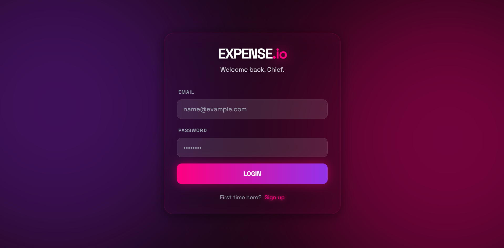
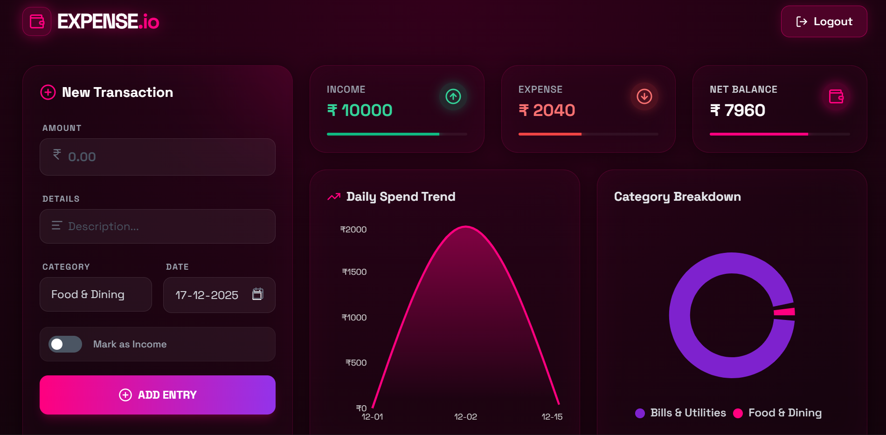
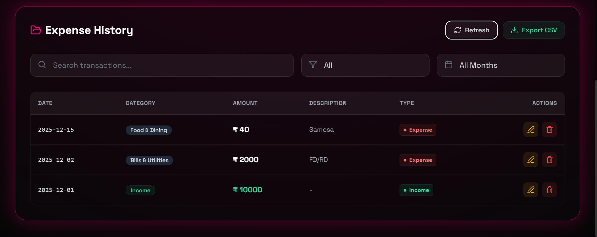

# 💰 Expense.io

A modern, secure, and easy-to-use **Personal Expense Tracker web application** built using **React (TypeScript)** and **Supabase**.  
This app helps users track daily expenses and income, visualize spending patterns, and manage personal finances efficiently — without using any AI.

---

## 📌 Introduction

Managing personal finances can quickly become overwhelming without proper tracking.  
This Expense Tracker provides a simple yet powerful interface to record expenses, categorize them, analyze spending trends, and export data when needed.

The application uses **Supabase** for authentication and database management, ensuring data security with **Row Level Security (RLS)**.  
The frontend is built with **React + TypeScript** and styled using **Tailwind CSS**, offering a clean and responsive UI with dark mode support.

---

## ✨ Features

- Secure user authentication (Signup / Login / Logout)
- Add income and expense entries
- Edit and delete existing transactions
- Category-wise expense tracking
- Monthly expense & income summary
- Interactive dashboard with charts
- Search and filter expense history
- Pagination for large datasets
- Export expenses to CSV
- Dark mode support
- Fully responsive UI

---

## 🧰 Tech Stack

### Frontend
- React (Vite)
- TypeScript
- Tailwind CSS
- Recharts (Charts & Graphs)

### Backend / Services
- Supabase
  - Authentication
  - PostgreSQL Database
  - Row Level Security (RLS)
  - Auto-generated APIs

---

## 📁 Repository Structure

```
frontend/
├── src/
│   ├── components/
│   │   ├── AddExpense.tsx
│   │   ├── Dashboard.tsx
│   │   ├── ExpensesTable.tsx
│   │   ├── EditExpenseModal.tsx
│   │   └── DeleteExpenseModal.tsx
│   ├── lib/
│   │   └── supabaseClient.ts
│   ├── types/
│   │   └── Expense.ts
│   ├── utils/
│   │   └── exportCsv.ts
│   ├── App.tsx
│   ├── main.tsx
│   └── index.css
│ 
├──── .env
├────  public/
├────  tailwind.config.js
├────  postcss.config.js
├────  tsconfig.json
├────  package.json
└────  README.md
```

---

## Getting Started

### Prerequisites
- Node.js (v18 or higher)
- npm or yarn
- A Supabase account
- Git (optional, for cloning)

### Environment Variables 🔐

Create a `.env.local` file in the project root and add:
```
VITE_SUPABASE_URL=<your_supabase_url>
VITE_SUPABASE_ANON_KEY=<your_supabase_anon_key>
```

### Install & Run

### 1️⃣ Clone the repository
```bash
  git clone https://github.com/SrujanPR/Expense.io.git
```
### 2️⃣ Install dependencies
```bash
npm install
```

### 3️⃣ Run the development server
```bash
npm run dev
```

---

## Application Working 🧠

1. Users sign up or log in using Supabase Authentication.
2. Each authenticated user can only access their own data due to Row Level Security.
3. Expenses are stored in a PostgreSQL table with user-level isolation.
4. The dashboard fetches and aggregates data for:
5. Monthly totals
6. Category-wise breakdown
7. Daily spending trends
8. Expense history supports filtering, searching, pagination, editing, and deletion.
9. CSV export generates downloadable files directly from the browser.

---

## Screenshots 🖼





---

## Security Notes 🔒 

- Supabase Row Level Security ensures users can only read/write their own records.
- No sensitive keys are exposed in the frontend.
- Authentication and database access are fully handled by Supabase.
- All queries are scoped to the authenticated user.

---

## Future Enhancements 🔮 

- Monthly budget limits and alerts
- Recurring expenses (subscriptions, rent)
- Data visualization by year
- PWA support
- Expense import from CSV
- Multi-currency support

---

## Contributing 🤝 

- Built by SRUJAN PR 🧠
- Open an issue to discuss substantial changes.
- Use conventional commits and PRs with clear descriptions.

---

## License 📄

This project is licensed under the MIT License.

---


⭐ Star this repo if it helped you!
